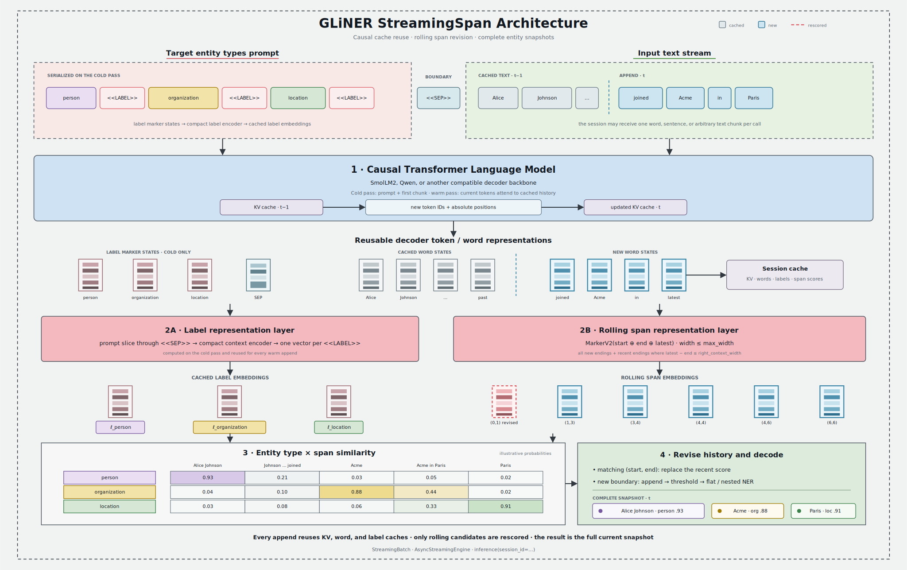

# StreamingSpan

StreamingSpan is GLiNER's architecture for named entity recognition over text
that arrives incrementally. It uses a causal decoder as the text backbone,
retains reusable state between chunks, and revises recent span predictions when
new right context becomes available.

Use the
[knowledgator/gliner-stream-pii-v1.0](https://huggingface.co/knowledgator/gliner-stream-pii-v1.0)
checkpoint to get started with streaming PII detection. `GLiNER.from_pretrained`
reads `model_type="gliner_streaming_span"` from the checkpoint and selects
`StreamingSpanGLiNER` automatically.

```python
from gliner import GLiNER

model = GLiNER.from_pretrained("knowledgator/gliner-stream-pii-v1.0")
model.eval()
```

## Quick start

Pass one chunk at a time with a stable session ID. The chunks are concatenated
exactly as supplied, so retain spaces and punctuation at chunk boundaries.

```python
labels = ["person", "email address", "phone number"]
session_id = "support-call-42"
chunks = [
    "Customer Alice Johnson ",
    "can be reached at alice@example.com ",
    "or +1 202-555-0147.",
]

try:
    for chunk in chunks:
        snapshot = model.inference(
            [chunk],
            labels,
            session_id=[session_id],
            threshold=0.5,
        )[0]
        print(snapshot)
finally:
    model.clear_session(session_id)
```

Each `snapshot` is the complete set of entities currently active for the
accumulated session text. It is not a list of only the entities detected in the
latest chunk. An entity has the same shape as an ordinary GLiNER prediction:

```python
{
    "start": 9,           # document-relative, inclusive character offset
    "end": 22,            # document-relative, exclusive character offset
    "text": "Alice Johnson",
    "label": "person",
    "score": 0.93,
}
```

Scores and even the active boundaries may change between snapshots as more
context arrives. Consumers that need an event stream should diff consecutive
snapshots by `(start, end, label)`.

## Architecture



StreamingSpan uses the following cold and warm paths:

1. On the first append, labels and text are serialized as
   `label<<LABEL>>...<<SEP>>text` and passed through the causal decoder.
2. A compact label context encoder processes only the prompt through
   `<<SEP>>`. Each `<<LABEL>>` state becomes an entity-type representation,
   which is cached.
3. Text subtokens are pooled into word representations. The model constructs
   span representations and scores them against the label representations.
4. On later appends, only the new decoder tokens are evaluated. Cached KV,
   label, and word states are reused and extended.
5. Scores for new and recently revisited span boundaries are merged into the
   session's score history, then the complete history is decoded.

The default `markerV2` span layer combines the candidate's start word, end
word, and latest visible word. Candidate width is bounded by `max_width`.
`right_context_width` determines how far behind the newest word an existing
span may be revisited; it defaults to `max_width`. Setting it to `0` keeps old
span scores fixed.

An optional `span_encoder_config` adds a dense-input DeBERTa-v2, ModernBERT, or
RNN encoder before span construction. A bidirectional span encoder can change
every historical word representation, so the model re-scores all historical
span candidates after each append. This still reuses causal decoder states;
`recompute=True` is the option that rebuilds the entire accumulated sequence.

For a component-level explanation, see
[GLiNER StreamingSpan](architectures.md) in the architecture guide.

## Choosing an inference mode

StreamingSpan provides four inference surfaces. They share prediction
semantics but differ in who owns the cache and how work is batched.

| Surface | Cache ownership | Scheduling | Best fit |
|---|---|---|---|
| `predict_entities` or `inference` without `session_id` | None | Ordinary GLiNER batching | Complete, independent texts |
| `inference(..., session_id=[...])` | One cache per ID on the model | Compatible sessions are batched per call | Flexible synchronous session sets |
| `create_streaming_batch(...)` | One persistent batched cache on the handle | Fixed rows advance together | Stable groups with aligned arrival cadence |
| `create_async_streaming_engine(...)` | One cache per ID on the model | Dynamic microbatching | Concurrent, independently arriving streams |

### Stateless inference

The architecture can process complete texts without retaining state. Omitting
`session_id` delegates to the ordinary GLiNER inference pipeline.

```python
entities = model.predict_entities(
    "Alice Johnson's email is alice@example.com.",
    labels,
    threshold=0.5,
)

batch = model.inference(
    ["Alice called.", "Bob emailed."],
    labels,
    batch_size=2,
)
```

Use stateless inference when the whole input is already available. It avoids
session lifecycle and cache-memory concerns.

### Flexible synchronous sessions

Supplying `session_id` turns each input into an append operation. Use one
stable, non-empty session ID per text; IDs must be unique within one call.

```python
session_ids = ["call-a", "call-b"]

first = model.inference(
    ["Alice Johnson ", "Bob Smith "],
    labels,
    session_id=session_ids,
    batch_size=8,
)
second = model.inference(
    ["shared her email.", "shared his number."],
    labels,
    session_id=session_ids,
    batch_size=8,
)

model.clear_session(session_ids)
```

Cold sessions are batched together. Warm sessions with the same cached decoder
length are also batched together; different lengths are processed in separate
groups. `batch_size` limits how many append requests enter a group at once.
Session order may change between calls because state is addressed by ID.

A blank chunk returns `[]` and does not advance that session. Labels must stay
in the same order for the lifetime of a session. To use a different label set,
clear the session or append non-empty text with `recompute=True`.

### Persistent fixed-order batches

When the same streams advance together, a persistent batch avoids repeatedly
stacking and splitting their historical KV caches. The session-to-row mapping
and labels are immutable for the handle's lifetime.

```python
with model.create_streaming_batch(
    session_ids=["call-a", "call-b"],
    labels=labels,
) as stream:
    first = stream.append(["Alice Johnson ", "Bob Smith "])
    second = stream.append(["shared her email.", "shared his number."])

    # Keep call-a unchanged while call-b advances.
    third = stream.append(["", " It is +1 202-555-0147."])
```

`append` returns one complete snapshot per row. An empty row retains its
existing snapshot. If every row is empty, no model forward is performed.

The handle offers two lifecycle operations:

- `reset()` discards the complete batched cache but keeps the handle, row
  mapping, and labels usable.
- `close()` releases the cache and permanently closes the handle. The context
  manager calls it automatically.

Passing `recompute=True` to `append` rebuilds every row from its complete
accumulated text. It is a batch-wide operation.

### Asynchronous dynamic microbatching

The asynchronous engine collects independently arriving appends for a short
window and sends compatible sessions through batched forwards. Calls for the
same session remain FIFO ordered, while different session IDs can be submitted
concurrently.

```python
import asyncio


async def consume(engine, session_id, chunks):
    latest = []
    async for latest in engine.stream(session_id, chunks, labels, threshold=0.5):
        print(session_id, latest)
    return latest


async def main():
    async with model.create_async_streaming_engine(
        max_batch_size=32,
        batch_wait_timeout_ms=2,
        queue_capacity=4096,
    ) as engine:
        results = await asyncio.gather(
            consume(engine, "call-a", ["Alice ", "shared her email."]),
            consume(engine, "call-b", ["Bob ", "shared his number."]),
        )
        await engine.clear_session("call-a")
        await engine.clear_session("call-b")
        return results


snapshots = asyncio.run(main())
```

The engine runs model work outside the event-loop thread and uses one worker per
engine, avoiding competing cache mutations and CUDA launches.
`max_batch_size` caps a microbatch, `batch_wait_timeout_ms` trades a small amount
of latency for more batching opportunities, and `queue_capacity` applies
backpressure to producers. Leaving the async context drains queued work and
closes the scheduler.

Use `await engine.clear_session(id)` while an engine is active; it waits for
earlier work on that session before removing the cache. Blank appends return
`[]` without entering the queue or changing state.

## Session and cache lifecycle

A session retains more than the decoder's KV tensors:

| Cached state | Purpose |
|---|---|
| Decoder KV and attention state | Lets new tokens attend to the prompt and historical text without re-encoding it |
| Pooled word states | Supports spans that cross chunk boundaries and recent span rescoring |
| Label representations | Avoids re-encoding an unchanged entity-type prompt |
| Text, tokens, and character offsets | Produces document-relative entity offsets and text |
| Span-score history | Preserves old candidates and replaces scores for revised boundaries |

KV, word, and label tensors stay with the model device. Historical span scores
are kept on CPU so the prediction history does not consume progressively more
accelerator memory.

For sessions created through `inference(..., session_id=...)` or the async
engine, use:

```python
model.clear_session("call-a")             # one session
model.clear_session(["call-b", "call-c"])  # several sessions
model.clear_sessions()                    # every model-owned session
print(model.session_count)
```

Persistent `StreamingBatch` handles own their cache separately and are not
included in `model.session_count`; use the handle's `reset()` or `close()`.
Model-owned sessions have no automatic TTL or LRU eviction.

### Context limits

The effective session limit is the smaller of `max_cache_length`, when set, and
the decoder backbone's native positional limit. The serialized label prompt
also consumes decoder positions. Streaming sessions disable preprocessing
truncation, and the implementation does not silently evict old context. An
append that would exceed the limit raises `ValueError`; finish and clear the
session, reset its batch, or start a new session.

This differs from stateless StreamingSpan and other GLiNER inference, where
`config.max_len` is a text-only splitter-token limit and an overlong input is
reduced to a prefix. See [Input limits and truncation](input_limits.md).

A persistent batch stores the padded physical width of every append. Group
streams with similar chunk sizes to reduce padded cache positions and avoid
reaching the physical context limit earlier than necessary.

## Prediction and revision controls

The streaming APIs accept the standard span-decoding controls:

| Option | Effect |
|---|---|
| `threshold` | Minimum entity score; defaults to `0.5` |
| `flat_ner` | If `True`, choose non-overlapping entities; set `False` for nested NER |
| `multi_label` | Permit more than one label for a span |
| `return_class_probs` | Add per-class probabilities to each returned entity |
| `recompute` | Rebuild state from all accumulated text instead of incrementally appending |

`packing_config`, `input_spans`, and external model-input tensors are not
supported when `session_id` is supplied. They remain available to the stateless
parent inference path where otherwise supported.

Two model configuration fields control incremental revisions:

- `max_width` is the maximum candidate span width in words.
- `right_context_width` is the number of words behind the latest word whose
  span endings are eligible for rescoring. `None` is normalized to `max_width`.

A larger right-context window can improve revisions at the cost of scoring more
candidates per append. `recompute=True` is useful as an occasional correctness
check or when changing labels, but it forfeits incremental decoder savings for
that call.

## Chunking guidance

- Prefer chunks that end at word, punctuation, or sentence boundaries. Splitting
  one logical word across calls makes the word splitter treat the pieces as
  separate streaming words.
- Preserve boundary whitespace. `"Alice "` followed by `"joined"` reconstructs
  `"Alice joined"`; `"Alice"` followed by `"joined"` reconstructs
  `"Alicejoined"`.
- Smaller chunks provide earlier updates but incur more Python, tokenization,
  decoding, and scheduling overhead. Larger chunks improve throughput but delay
  the first prediction.
- Use stable, tenant-safe session IDs and always clear abandoned sessions.
- Treat every response as replaceable state. Do not append snapshots directly
  to a result list as though they were deltas.

## Configuration and training

StreamingSpan checkpoints use `model_type: gliner_streaming_span`. The main
architecture-specific fields are:

| Field | Description |
|---|---|
| `model_name` / `decoder_config` | Causal decoder backbone and its saved configuration |
| `label_token` | Marker placed after each label; defaults to `<<LABEL>>` |
| `sep_token` | Boundary between the entity prompt and text; defaults to `<<SEP>>` |
| `labels_encoder_config` | DeBERTa-v2, ModernBERT, or RNN encoder for the compact prompt |
| `span_mode` | Span representation; StreamingSpan defaults to `markerV2` |
| `span_encoder_config` | Optional DeBERTa-v2, ModernBERT, or RNN word context encoder |
| `subtoken_pooling` | `first`, `last`, `mean`, or `max` pooling into words |
| `max_width` | Maximum entity span width in words |
| `right_context_width` | Rolling span revision window |
| `max_cache_length` | Optional upper bound on cached decoder positions |
| `max_len` | Stateless preprocessing limit; cached sessions use the decoder context limit instead |

Normally these values should come from the checkpoint rather than be overridden
at inference time. To train or fine-tune the architecture, adapt
`configs/config_streaming_span.yaml` and use the normal GLiNER training entry
point:

```bash
python train.py --config configs/config_streaming_span.yaml
```

The data format and general trainer options are the same as for other
span-based GLiNER models; see [Training](training.md) and
[Configuration](configs.md). The executable
[inference modes example](https://github.com/urchade/GLiNER/blob/main/examples/streaming_inference_modes.py)
demonstrates every serving surface, while the
[interactive streaming example](https://github.com/urchade/GLiNER/blob/main/examples/streaming_span.py)
shows how to diff and render live snapshots.
